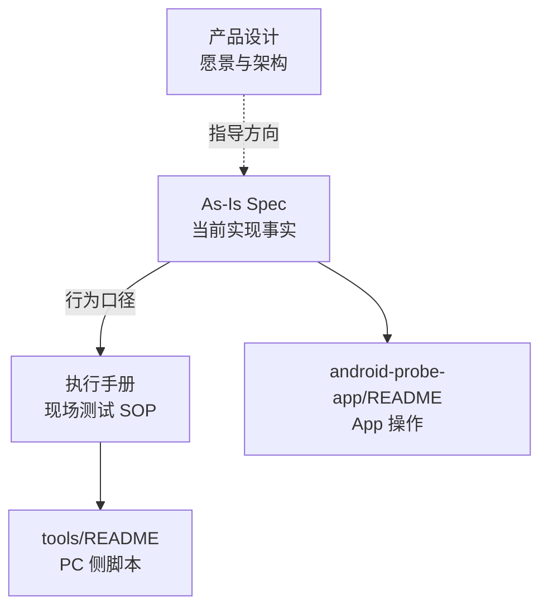

# 云聚通 Probe 文档索引

本目录为 MNATool 探针相关文档的**单一入口**。按角色选用：

| 角色 | 文档 | 用途 |
|------|------|------|
| **测试执行** | [云聚通Probe网络测试执行手册.md](./云聚通Probe网络测试执行手册.md) | 双平板 MQTT 现场流程、R1/R2 场景、Clumsy 弱网、ABBA、脚本命令、判定标准 |
| **App 开发** | [android-probe-as-is.md](./android-probe-as-is.md) | 从代码反推的 As-Is 规格：状态机、Runner、指标口径、导出、已知问题 B1–B14 |
| **产品/架构** | [云聚通Android网络测试工具设计.md](./云聚通Android网络测试工具设计.md) | 原始愿景与总体架构（MQTT+UDP、弱网、ABBA、指标定义）；**实现细节以 As-Is 为准** |
| **脚本与构建** | [tools/README.md](../tools/README.md) | 编译、测后归档、ABBA 报告、飞书同步 |
| **App 使用** | [android-probe-app/README.md](../android-probe-app/README.md) | 安装、三页操作、参数说明 |

## 文档关系

- **改 App 逻辑**：先更新 `android-probe-as-is.md`，再同步执行手册与 `AGENTS.md`。
- **跑正式测试**：只跟执行手册；指标判读以手册 §2.6、§5 为准。
- **查历史设计/Plan**：见 [archive/](./archive/)（已实现，仅供追溯）。

## 外部归档

- 主结论 Wiki：[云聚通 Probe 测试结论（飞书）](https://q00enigbkuh.feishu.cn/wiki/O7YPwqYNoi2icrk3X7ccLSJCnae)
- 业务记录模板：[测试记录 v2.0（飞书）](https://q00enigbkuh.feishu.cn/wiki/WlqwwWRnpiLJ2fkSDWmc9P20nJg)
