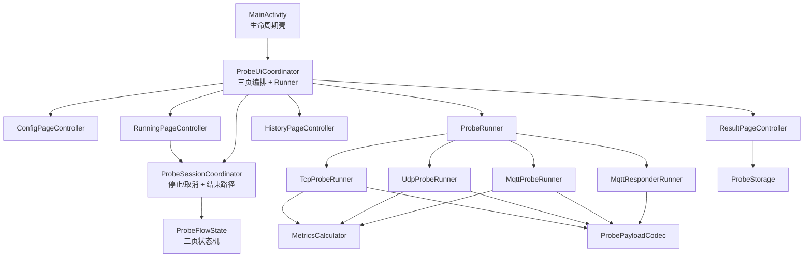
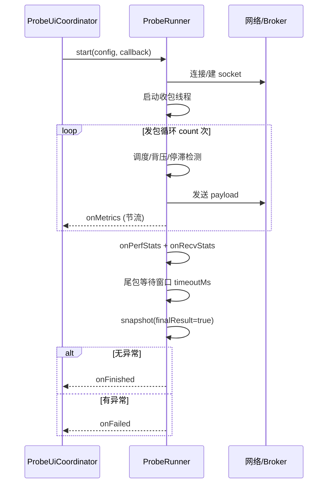

# Android Probe App 现状规格书（As-Is Spec）

> **目的**：从现有代码反推可执行规格，理清核心流程、边界处理、异常处理与特殊逻辑；作为 Spec-Kit 后续 Plan 的单一事实来源。  
> **范围**：`android-probe-app/` 探测端与回显端；不含 `tools/` 脚本实现细节。  
> **非目标**：本次不重写代码；不改变导出格式与指标口径。

---

## 1. 产品定位

独立 Android 横屏探针 App，验证云聚通系统级 VPN 对 **UDP / TCP Echo / MQTT** 链路的时延、丢包、稳定性影响。

| 能力 | 说明 |
|------|------|
| 三协议探测 | UDP 定频、TCP 长连接 JSON line、MQTT 自定义客户端（QoS 0） |
| 双平板 MQTT | 探测端测 RTT；回显端订阅本机 SN 并转发对端 SN |
| 实时看板 | 指标卡片 + RTT 图（全览/跟随/细节）+ 丢包色带 + 逐包记录 |
| 可审计导出 | `samples.csv` + `summary.json`；回显端另导 `echo_received.csv` |
| ABBA 对照 | 结果页按 modeTag 对立配对本地历史，或会话内上次 vs 本次 |

**非目标**：App 内不实现云聚通 VPN；MQTT 应用层丢包不等同 UDP 底层丢包。

---

## 2. 架构与模块职责

**配置常量**：可调阈值、超时、端口上下界等集中于 `util/ProbeConstants.java`（后缀 `_MS`/`_NS`/`_PPS`/`_PKT`/`_B`/`_PCT` 标明单位）；档位预设见 `util/ProbeDefaults`，MQTT 环境默认见 `runner/mqtt/MqttDefaultProfile`。

**源码包结构**（`com.mnatool.yunjutongprobe`，`applicationId` 不变）：

| 子包 | 典型类 |
|------|--------|
| （根） | `MainActivity`（~44 行生命周期壳） |
| `ui` | `ProbeUiCoordinator`、`ProbeRunContext` |
| `ui.config` / `ui.running` / `ui.result` / `ui.history` | 各页 Controller + Views + `ProbeConfigStore` |
| `ui.common` / `ui.chart` | `ProbeViewFactory`、`TabletLayout`、`ConfigSummaryUi`、`MetricsChartView` |
| `session` | `ProbeFlowState`、`ProbeSessionCoordinator` |
| `runner` / `runner.mqtt` | `*ProbeRunner`、`ProbeRecvStats`、`MqttTokenProvider` |
| `model` / `metrics` / `codec` / `storage` / `util` | 配置 DTO、指标、payload、导出、常量 |

> **包迁移**：已完成；根包仅保留 `MainActivity` 生命周期壳，其余类均在子包（`migrate_packages.py` 为一次性迁移脚本，勿重复执行）。

MQTT 探测/回显为运行时角色（`ProbeConfig.Role`），不按子包拆分。



| 模块 | 职责 |
|------|------|
| `MainActivity` | Activity 生命周期壳（`onCreate` / `onDestroy` / 权限 / 返回键），委托 `ProbeUiCoordinator` |
| `ProbeUiCoordinator` | 页面容器、Controller 接线、MQTT Token 预取、步骤徽章、权限回调 |
| `ProbeRunContext` | 跨页共享：`runner`、`pendingExportKind`、指标快照、对比基线等 |
| `ProbeSessionCoordinator` | 无 Android 依赖；`stopRequested`/`cancelRequested` + `onRunnerFinished`/`onRunnerFailed` 解析 |
| `ConfigPageController` + `ProbeConfigStore` | 参数页 UI、SharedPreferences、校验与 `startProbe` |
| `RunningPageController` | 运行监测 UI、指标/图表刷新、停止/取消/待确认完成 |
| `ResultPageController` + `ProbeAccelCompare` | 结果展示、导出、加速对比判决与文案 |
| `HistoryPageController` | 历史列表/详情 overlay |
| `ProbeViewFactory` | 纯 Java View 工厂（dp/panel/button/text 等） |
| `ProbeFlowState` | CONFIG / RUNNING / RESULT + awaitingConfirm |
| `*ProbeRunner` | 协议探测/回显；统一 `start` / `stop` |
| `MetricsCalculator` | 运行中 vs 最终结算两套丢包口径 |
| `ProbePayloadCodec` | JSON / Compact 双格式、回显打戳 |
| `ProbeRecvStats` | 收包停滞、弱网策略、Broker 断连侧写 |
| `ProbeStorage` | Downloads 导出、index.json、历史列表 |

---

## 3. UI 状态机（`ProbeFlowState`）

### 3.1 页面

| 状态 | 含义 |
|------|------|
| `CONFIG` | 参数设置 |
| `RUNNING` | 运行中（含 `awaitingConfirm` 子态） |
| `RESULT` | 测试结果 |

### 3.2 结束结果（`Outcome`）

| Outcome | 触发条件 | 是否导出 | 页面行为 |
|---------|----------|----------|----------|
| `COMPLETED` | 发包完成 + 尾包等待结束 | 是（探测端） | 先 `awaitingConfirm`，用户点「查看测试结果」后进 RESULT |
| `STOPPED` | 用户「停止并查看结果」 | 是 | 直接进 RESULT |
| `FAILED` | 连接/鉴权/运行异常 | 是（若有样本） | 直接进 RESULT |
| （取消） | 用户「取消测试」 | **否** | `cancelRun` → 回 CONFIG |

### 3.3 状态转换表

| 当前 | 事件 | 下一状态 | 备注 |
|------|------|----------|------|
| CONFIG | `begin(runId)` 成功 | RUNNING | 生成 runId，注册 Runner |
| RUNNING | 探测自然完成 `onFinished` | RUNNING + awaitingConfirm | `completePending`；不自动进 RESULT |
| RUNNING + awaitingConfirm | `confirmResult()` | RESULT | 触发导出与对比 |
| RUNNING + awaitingConfirm | 返回键 | CONFIG | `resetForRetest`，**不导出** |
| RUNNING | 停止 `onFinished` + stopRequested | RESULT | `finishRun(STOPPED)` |
| RUNNING | `onFailed` | RESULT | `finishRun(FAILED)` |
| RUNNING | 取消 `onFinished/onFailed` + cancelRequested | CONFIG | `cancelRun`，不写历史 |
| RESULT | 再次测试 / 返回键 | CONFIG | 保留参数，清运行态 |
| 任意 RUNNING | 迟到回调（runId 不匹配） | 不变 | `flow.accepts(runId)` 丢弃 |

### 3.4 runId 防护

- 每次 `startProbe` 生成 12 位 hex `runId`
- 所有 `ProbeCallback` 在 UI 线程先检查 `flow.accepts(runId)`
- `finish` / `completePending` 成功后清空 `activeRunId`，后续回调一律忽略

### 3.5 UI 导航

- **无顶部步骤条**；左上角固定**圆形步骤徽章**（序号 1–3），点击弹出三页流程说明。
- 内容区按 `TabletLayout.stepBadgeClearanceDp` 为徽章留白；运行页保留「当前配置」摘要卡。
- 历史记录为参数页次级入口（overlay），不破坏三页主流程。

---

## 4. 开始测试链路（`startProbe`）

```
校验参数 → refreshVpnState → 构建 ProbeConfig → saveCurrentConfig
→ createRunner(protocol, role) → flow.begin(runId)
→ runner.start(config, callback)
```

| 步骤 | 细节 |
|------|------|
| VPN 快照 | `VpnState.isVpnActive()` **仅在开始瞬间**检测，写入 `config.vpnActiveAtStart`，全程不再更新 |
| Runner 选择 | TCP→`TcpProbeRunner`；MQTT+PROBE→`MqttProbeRunner`；MQTT+RESPONDER→`MqttResponderRunner`；否则 UDP |
| 回调线程 | Runner 后台线程 → `runOnUiThread` + `accepts(runId)` |
| 指标节流 | 图表 ~400ms；逐包记录 ~1000ms；Runner `onMetrics` MQTT 侧 ~1000ms |

### 4.1 参数校验（`validateProtocolConfig` + `parseInt`）

| 字段 | 规则 |
|------|------|
| host | 非 MQTT 不能为空；MQTT 用中转服务器 Spinner |
| port | 可空，默认 UDP 9001 / TCP 9002 / MQTT 1883 |
| count | 1–200,000 |
| pps | 1–8,000 |
| packetBytes | 1–2,000（构建层最小 20B） |
| timeoutMs | 100–300,000 |
| MQTT env / SN / topics | 必填 |
| MQTT Token | 手动非空，或自动取 Token 需设备密码 + 合法 MAC |
| 弱网 Profile | 工具/丢包%/延迟/抖动/备注，写入 summary |

### 4.2 双档预设（`ProbeDefaults` VERSION=4）

| 档位 | count | pps | bytes | timeout |
|------|-------|-----|-------|---------|
| FIELD | 1000 | 10 | 200 | 5000 |
| LAB | 100000 | 2000 | 100 | 60000 |

高 PPS 判定：`count≥50000` 或 `pps≥500` → 回显端不落 echo seq。

---

## 5. 探测 Runner 生命周期（统一模式）



### 5.1 停止语义

| 操作 | `running` | 结算时机 | finalResult |
|------|-----------|----------|-------------|
| `runner.stop()` | false | 等 `onFinished`/`onFailed` | true（finally 块） |
| 取消测试 | stop + cancelRequested | 同上，UI 层 `cancelRun` 丢弃结果 | — |

**原则**：`requestStop` / `requestCancel` **不**在 UI 层抢先 `finishRun`，必须等 Runner 回调后再结算，避免丢包与 perf 统计错误。

### 5.2 UDP（`UdpProbeRunner`）

1. `DatagramSocket`，收包线程 `receiveLoop`
2. 定速发包：`ProbeSendScheduler.capCatchUp` 限制追发 burst
3. 停滞检测：`ProbeRecvStats.forConfig`（弱网则 warn-only）
4. 尾包等待：`timeoutMs` 内轮询直到收满或超时
5. `finally`：`snapshot(timeoutNs, true)` → `onFinished`/`onFailed`

### 5.3 TCP（`TcpProbeRunner`）

1. `Socket` 连接 + `BufferedReader` 按行读回显
2. 发包/收包逻辑同 UDP 调度与停滞策略
3. **特殊**：`receiveLoop` 中 `readLine()==null` 时写入 `receiverFailure`（对端断连）→ finally 走 `onFailed`；尾包等待循环亦检查 `receiverFailure`，断连后不再空等满 timeout

### 5.4 MQTT 探测端（`MqttProbeRunner`）

1. Token 获取（空密码时 `MqttTokenProvider.getToken`）
2. 自定义 MQTT：CONNECT → CONNACK → SUBSCRIBE → SUBACK
3. 收包线程 `receiveLoop` + 主线程定速 PUBLISH
4. **弱网背压**：`inFlightCap = max(1000, pps×8)`，超限则 `waitForInFlightRoom` 阻塞
5. **Broker 断连**：`handleConnectionIoFailure` → `mqttConnectionLost=true`，停发，进入尾包等待
6. PING 每 10s；`readPacket` header 100ms 超时，body 用 `readByteRetry`
7. `finally`：未断连时发 DISCONNECT → `closeSocket` → join receiver

### 5.5 MQTT 回显端（`MqttResponderRunner`）

1. 连接 Broker，订阅本机 topic
2. **高 PPS 架构**：读线程入队 + 回显线程出队（队列 4096）
3. `stampEchoOnce` 打戳后转发对端 topic
4. 按配置决定是否写 `EchoRecord`（高 PPS 跳过）
5. `onEchoRecords` 回传列表；`onFinished` 样本列表为空（指标用 received/echoed 计数）
6. **finally**：先 `sendDisconnect` 再 `closeSocket`（B4 已修复）

---

## 6. 指标与丢包结算（`MetricsCalculator`）

### 6.1 `finalResult` 双口径

| 模式 | `finalResult` | 未收包处理 | UI 标签 |
|------|---------------|------------|---------|
| 运行中 | false | 仅 `now - sendNs > timeout` 计丢包 | 「超时丢包率」 |
| 最终结算 | true | **所有**未收包计丢包 | 「丢包率」 |

在途包（未超时未收）：运行中不计丢包、`maxBurstLoss` burst 清零；最终结算全部计入。

### 6.2 RTT 计算（`ProbeSample`）

| 包类型 | RTT 基准 |
|--------|----------|
| JSON | `clientRecvNs - clientSendNs`（nanoTime） |
| Compact | `clientRecvMs - clientSendMs`（wall-clock ms） |

分段时延：`ProbeSegmentTiming` 用回显 JSON 中 `serverRecvNs/serverSendNs` 拆分去程/回显/回程。

### 6.3 发包性能（`ProbePerfStats`）

- 统计实际 PPS vs 目标
- `belowTarget` 时 UI 告警 + 写入 `summary.perf`

### 6.4 收包侧写（`ProbeRecvStats`）

| 策略 | `stopPublishOnStall` | `stallPolicy` | 行为 |
|------|----------------------|---------------|------|
| 默认（正常网） | true | `default` | ≥8s 无新 seq → 告警 + **提前停发** |
| 弱网 Profile 激活 | false | `weak_net_warn_only` | ≥8s 告警，**继续发满 Count** |

另记录：`mqttConnectionLost`、`inFlightThrottleCount`、`catchUpResetCount` 等 → `summary.recv`。

---

## 7. Payload 特殊逻辑（`ProbePayloadCodec`）

### 7.1 格式选择

```
packetBytes < minJsonPayloadBytes(config)  →  Compact
否则                                      →  JSON（含 pad 填充至目标长度）
```

Compact 格式：`{sendMs},{seq},AAA…`（Autel 联调兼容）；回显端原样转发。

### 7.2 回显打戳

- JSON：写入 `serverRecvNs/serverSendNs/serverRecvMs/serverSendMs`
- Compact：仅解析 seq/sendMs，不打戳（payload 原样转发）

### 7.3 解析守卫

- JSON 回显：校验 `runId` 匹配
- Compact：不校验 runId，仅解析 seq

---

## 8. 导出与历史配对

### 8.1 导出路径

`Download/YunJuTongProbe/probe_{yyyyMMdd_HHmmss}_{runId}/`

| 文件 | 条件 |
|------|------|
| `samples.csv` | 探测端，有样本 |
| `summary.json` | 同上 |
| `echo_received.csv` | 回显端，有 EchoRecord |
| `index.json` | 每次 writeRun 追加条目 |

### 8.2 导出触发

| 路径 | 触发 |
|------|------|
| 自动 | `applyResultPage` → 探测端 `exportLastRun(false)` / 回显端 `exportEchoRun()` |
| 手动 | 结果页「再次导出」 |
| 不导出 | 取消测试；awaitingConfirm 下返回键放弃 |

### 8.3 加速对比配对（`autoCompareWithHistory`）

匹配条件（全部满足，取 exportStamp 最近）：

1. `protocol` 相同
2. `count` 相同
3. `modeTag` = 当前 mode 的**对立**（未加速↔云聚通加速，弱网基线↔弱网加速）
4. `host` 相同
5. `weakNetSummary` 一致（index 缺省时仅当当前无弱网才配对）

找不到 → 退回会话内 `prevMetrics` vs 当前（`updateCompare`）。

判决阈值（`ProbeAccelCompare.computeVerdict`，`ResultPageController` 仅负责展示）：

- 样本 < 50：样本不足
- loss/p95/p99 恶化 > 10%：负向
- loss ≤ -50% 或 p95 ≤ -10% 且 p99 ≤ 10%：明显改善
- avg/p95/loss 任一改善 > 5%：部分改善
- 否则：无明显效果

对比 UI 展示 Avg/P95/P99/丢包改善率；**不含 p50 改善率**（主结论以飞书主表 p50/p99/p50 为准，见执行手册归档流程）。

---

## 9. 异常处理矩阵

### 9.1 Runner 层

| 异常场景 | UDP/TCP | MQTT 探测 | MQTT 回显 |
|----------|---------|-----------|-----------|
| DNS 失败 | onFailed | onFailed | onFailed |
| 连接超时 | onFailed | onFailed | onFailed |
| 鉴权失败 | — | onFailed (SecurityException) | 同左 |
| 运行中 IO 错误 | onFailed | 断连→停发→onFinished* | onFailed |
| 用户 stop | onFinished(STOPPED) | 同左 | 同左 |
| TCP 服务端关连接 | onFailed | — | — |

\* MQTT 断连时 `failure` 可能为 null，仍走 `onFinished`

### 9.2 UI 文案（`ProbeErrorMessage`）

| 异常类型 | 用户文案 |
|----------|----------|
| UnknownHostException | 无法解析服务器地址… |
| SocketTimeoutException | 连接超时… |
| ConnectException | 服务器拒绝连接… |
| SecurityException | MQTT 鉴权失败… |
| CONNACK/SUBACK 超时 | MQTT 响应超时… |
| socket closed | 网络连接已断开… |
| 其他 | 原文或通用失败提示 |

### 9.3 权限与导出

- Android ≤9 需 `WRITE_EXTERNAL_STORAGE`
- 缺权限时 `ProbeRunContext.pendingExportKind` 记为 `PENDING_EXPORT_PROBE` 或 `PENDING_EXPORT_ECHO`
- `ProbeUiCoordinator.onRequestPermissionsResult` 授权后按 kind 分别调用 `exportLastRun` / `exportEchoRun`

### 9.4 生命周期

- `ProbeUiCoordinator.onDestroy`：`runner.stop()` → `runner = null`；取消 MQTT Token 预取 Handler，避免销毁后 UI 回调

---

## 10. 边界条件速查表

| 边界 | 行为 |
|------|------|
| 重复 start | Runner 拒绝：「已有测试在运行」 |
| 发包滞后 | `capCatchUp` 丢弃积压槽位，记 `catchUpResetCount` |
| 弱网在途上限 | MQTT：`8s × pps`；UDP/TCP 无在途上限 |
| 收包停滞 8s | 正常网停发；弱网仅告警 |
| 高 PPS 回显 | 不落 echo seq；Responder 双线程+背压队列 |
| 自然完成未点查看 | 不导出（仍在 awaitingConfirm） |
| 失败零样本 | 不进有效对比；导出按钮禁用 |
| VPN 检测 | 仅起测快照 `vpnActiveAtStart`；无法检测「VPN 存在但流量未走 VPN」；正式 ABBA 由执行手册人工核对 VPN 开关 |
| 历史 CSV 回放 | `ProbeCsvReader` 仅还原 RTT（历史页 RTT 图）；不还原 `serverRecvNs/serverSendNs`（历史页无分段时延视图） |
| 加速对比 p50 | 结果页对比卡不含 p50 改善率；`index.json` 已写 `p50RttMs`，主结论见飞书归档 |
| 导出格式兼容 | App 子目录 `probe_*/{samples,summary}.json`；旧版扁平文件由 `migrateFlatExportsIfNeeded` 与 `tools/probe_run_lib` 双路径识别 |
| Compact 最小包 | UI/构建最小 20B |
| 图表手势中 | 暂停数据刷新，避免主线程卡顿 |

---

## 11. 已关闭问题清单（归档）

Spec-Kit 增量重构期间发现并修复的问题，供追溯；**当前无待修复项**。

| ID | 问题 | 修复摘要 |
|----|------|----------|
| **B1** | MQTT 断连后尾包等待未检查 `mqttConnectionLost` | 尾等循环加 `!mqttConnectionLost` 守卫 |
| **B2** | `metricsFromRecord` 硬编码 `p50RttMs=0` | 从 `ProbeRunRecord` 读取 |
| **B3** | `index.json` 缺 `p50RttMs`、`weakNetSummary` | `ProbeStorage` 写入 |
| **B4** | 回显端 `finally` 先 `closeSocket` 再 `sendDisconnect` | 调整顺序 |
| **B5** | 存储权限回调只补探测端导出 | 按 `pendingExportKind` 分流 |
| **B6** | TCP `readLine()==null` 静默结束 | `receiverFailure` → `onFailed`（`TcpProbeRunnerTest`） |
| **B7** | `MainActivity` ~4100 行耦合 | `ProbeUiCoordinator` + 分页 Controller |
| **B8** | 对比判决逻辑重复 | 集中于 `ProbeAccelCompare` |
| **B9** | `onDestroy` 停 Runner 但不注销回调 | `runner = null` + 取消 Token Handler |
| **B10** | `requestStop` 未使用变量 | 停止标志迁至 `ProbeSessionCoordinator` |

未纳入修复的已知限制见 **§10 边界条件速查表**（VPN 快照、历史 CSV 回放口径、p50 对比 UI、导出格式兼容）。

---

## 12. 单元测试覆盖

| 单测 | 覆盖点 |
|------|--------|
| ProbeFlowStateTest / ProbeSessionCoordinatorTest | 状态转换、停止/取消、迟到回调 |
| ProbeConfigStoreTest | 参数持久化与校验 |
| ProbePayloadCodecTest | JSON/Compact 编解码 |
| MetricsCalculatorTest | finalResult 丢包口径 |
| ProbeRecvStatsTest | 停滞策略、Broker 断连侧写 |
| ProbeSendSchedulerTest | catch-up 上限 |
| MqttProbeRunnerTest / TcpProbeRunnerTest | MQTT/TCP 关键路径（含 TCP 对端断连） |
| ProbeStorageTest / ProbeCsvReaderTest | 导出、索引、CSV 回放 |
| ProbeSegmentTimingTest | 分段时延日志与 JSON 打戳 |

UI 三页流程（取消/待确认/权限回调）依赖手工回归；导出格式由 `ProbeStorageTest` 与 `tools/verify_probe_run.py` 双重校验。

---

## 13. 参考文档

| 文档 | 关系 |
|------|------|
| [docs/README.md](./README.md) | 文档索引 |
| [云聚通Android网络测试工具设计.md](./云聚通Android网络测试工具设计.md) | 原始设计意图 |
| [云聚通Probe网络测试执行手册.md](./云聚通Probe网络测试执行手册.md) | 操作与场景 |
| [AGENTS.md](../AGENTS.md) | 协作约定与特殊逻辑备忘 |
