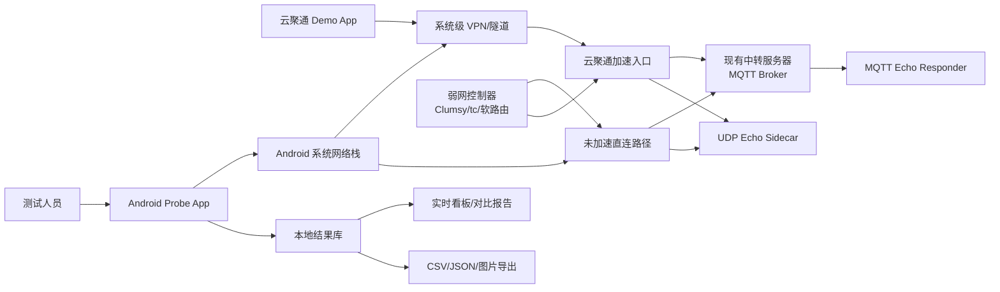
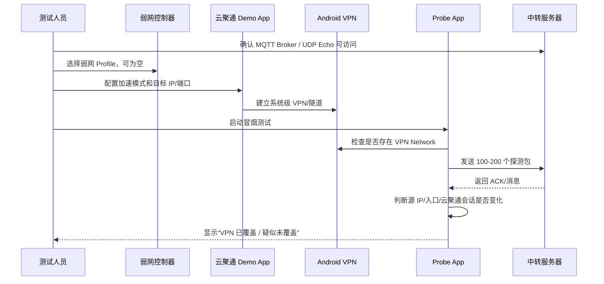
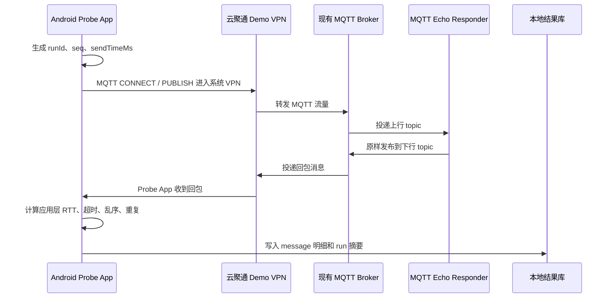
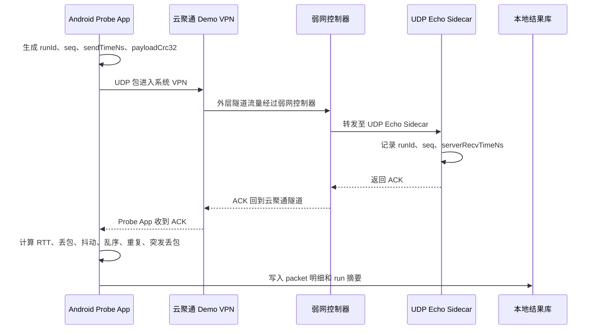
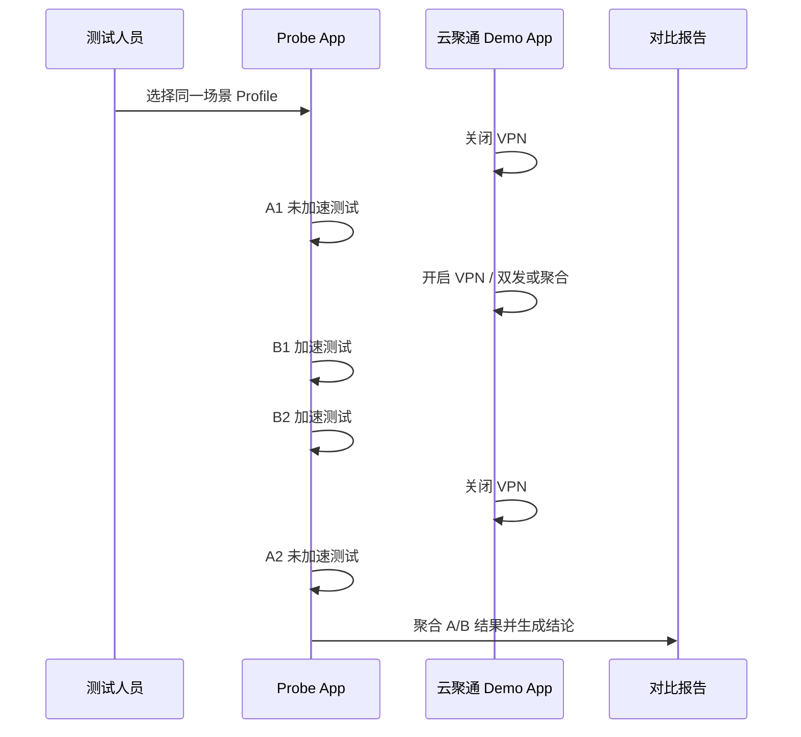

# 云聚通 Android 网络测试工具设计方案

> **文档定位**：产品愿景与总体架构（2026 年初稿）。**当前实现与行为口径**以 [android-probe-as-is.md](./android-probe-as-is.md) 为准；**现场测试**以 [云聚通Probe网络测试执行手册.md](./云聚通Probe网络测试执行手册.md) 为准。文档索引见 [README.md](./README.md)。

## 1. 结论先行

为了验证腾讯云聚通的加速能力，建议做一个独立的 Android Probe App，并保留两条测试链路：

- **MQTT Probe**：复用现有 MQTT 中转链路和 `MqttTestPython` 脚本思路，验证现有业务中转链路在云聚通 VPN 下的应用层往返时延、超时、断链和消息丢失。
- **UDP Probe**：新增 UDP 发包能力，对齐 `References/OpenFEC与P2P测试对比_0806.xlsx` 的 UDP/FEC 测试口径，验证云聚通对弱网、丢包、抖动、长尾时延的网络数据面效果。

服务端不必一开始另建完整平台。可以先复用现有中转服务器：

- MQTT 部分继续使用现有 MQTT Broker/业务中转链路。
- UDP 部分在现有中转服务器同机或同网段旁挂一个轻量 UDP Echo Sidecar。

最终报告不要复刻 Excel 的宽表。App 内应实时给出“是否改善、改善在哪、是否可信”，再允许钻取包级明细。

## 2. 背景与依据

当前云聚通调研结论偏业务侧，主要使用故障扫描、在线编程成功率、编程耗时等指标。这些指标能说明业务是否可用，但无法解释云聚通到底改善了时延、丢包、抖动还是链路稳定性。

已确认依据：

- 云聚通 Demo App 建立系统级 VPN/隧道，可代理其他 App 流量。
- 本地 `References/MqttTestPython` 脚本已具备 MQTT 双端回环能力：发送端发布消息，接收端原样回发，发送端根据消息时间戳计算往返时延。
- `References/OpenFEC与P2P测试对比_0806.xlsx` 测的是 `P2P(基于UDP)`、`FEC+P2P(UDP单/双通道)`、NACK、注入丢包/时延后的数据面效果，不是单纯业务成功率。

## 3. 目标与非目标

目标：

- 在 Android 上运行独立 Probe App，通过云聚通 Demo App 的系统级 VPN 验证加速前后差异。
- 同时支持 MQTT/TCP 和 UDP 两种 Probe。
- 实时展示测试质量，避免测试结束后再人工翻 Excel。
- 输出可审计数据：run 摘要、packet/message 明细、事件日志、对比结论。

非目标：

- 不在 Probe App 内实现云聚通能力，云聚通仍由 Demo App 负责。
- 不替代最终业务验收，业务测试仍保留。
- 不把 MQTT/TCP 结果等同于 UDP 原始丢包结果。二者结论分开。

## 4. 总体架构



组件职责：

| 组件 | 职责 |
|---|---|
| Android Probe App | 发包、收包、统计、实时展示、导出报告 |
| 云聚通 Demo App | 配置加速策略，建立系统级 VPN/隧道 |
| 现有中转服务器 | 作为 MQTT Broker/业务链路目标，也承载 UDP Echo Sidecar |
| MQTT Echo Responder | 订阅上行 topic，原样发布到下行 topic，等价于 MQTT 回显端 |
| UDP Echo Sidecar | 收 UDP 包后立即 ACK，记录服务端收到的 seq 和时间 |
| 弱网控制器 | 在 Android 出口侧注入时延、丢包、抖动、乱序 |

## 5. 交互时序

### 5.1 测试准备与 VPN 覆盖校验



冒烟校验必须在正式测试前执行。否则 Probe App 流量可能没有走云聚通 VPN，后续结论无效。

### 5.2 MQTT Probe 时序

MQTT Probe 用于验证现有业务中转链路，复用 `mqtt_send_both.py` 和 `mqtt_recieve_both.py` 的思路。



MQTT 结果解释口径：

- 能说明云聚通对业务中转链路的应用层体验是否改善。
- 能观察 RTT、p95/p99、断链、重连、超时。
- 不能直接代表底层 UDP 丢包率，因为 TCP 会重传并掩盖底层丢包。

### 5.3 UDP Probe 时序

UDP Probe 用于验证网络数据面能力，是弱网和丢包验证的核心。



UDP 结果解释口径：

- 能验证云聚通对丢包、弱网、抖动、长尾 RTT 的改善。
- 能对齐 OpenFEC/P2P 表格的 UDP 数据面口径。
- 如果云聚通 Demo App 不代理 UDP，则 UDP Probe 只能作为未加速网络基线，不能用于云聚通结论。

### 5.4 ABBA 对照时序



ABBA 的目的是降低不同时段网络波动造成的误判。

## 6. 现有中转服务器怎么用

### 6.1 MQTT

现有中转服务器继续作为 MQTT Broker。需要新增或稳定化一个 MQTT Echo Responder：

- 订阅上行 topic，例如 `probe/{runId}/up/{deviceId}`。
- 收到消息后原样发布到下行 topic，例如 `probe/{runId}/down/{deviceId}`。
- 尽量部署在 Broker 同机、同 VPC 或同机房，避免额外公网链路影响结论。

如果 Broker 支持规则引擎或插件，可以直接在 Broker 内部回显，减少 Echo Responder 的进程依赖。

### 6.2 UDP

建议在现有中转服务器旁挂 UDP Echo Sidecar：

- 监听测试端口，例如 `udp/9001`。
- 收到包后立即 ACK，不进入业务逻辑。
- 记录服务端收到的 `runId、seq、clientIp、serverRecvTimeNs、packetSize、crcValid`。
- 提供本地日志文件或 HTTP 导出接口。

不建议直接改业务服务，因为业务逻辑会干扰网络数据面指标。

### 6.3 UDP Probe 是否需要做 P2P 直连

MVP 不建议把 UDP Probe 做成完整 P2P 打洞直连。

`References/OpenFEC与P2P测试对比_0806.xlsx` 的价值主要在测试方法：固定包长、发包数、注入丢包/时延、单/双通道、NACK/FEC，再统计丢包率、RTT、长尾和重传。表格中出现了 `P2P(基于UDP)`、`FEC+P2P(UDP单/双通道)`，但没有看到打洞、NAT、STUN/TURN、穿透成功率等测试项。因此这里应先对齐它的 UDP 数据面口径，而不是完整复刻 P2P 建连过程。

推荐分三阶段：

| 阶段 | UDP 形态 | 目的 | 是否必需 |
|---|---|---|---|
| MVP | Android Probe App -> 现有中转服务器 UDP Echo Sidecar | 验证云聚通对 UDP 弱网、丢包、长尾 RTT 的改善 | 必需 |
| V1 | Android Probe App -> UDP Echo Sidecar，增加双通道/多网卡标记 | 验证双发/聚合在不同链路上的表现 | 建议 |
| V2 | Android A <-> Android/B 端或诊断端 P2P UDP，含打洞/穿透 | 复刻真实 P2P 业务链路，验证 P2P 建连与数据面 | 视业务需要 |

如果第一阶段就做 P2P 打洞，会把两个问题混在一起：

- P2P 是否建连成功。
- 云聚通是否改善 UDP 丢包和时延。

这会增加实验变量，反而不利于证明云聚通能力。建议先用固定 UDP Echo Sidecar 把网络数据面测清楚；如果结论显示云聚通对 UDP 数据面有效，再补 P2P 打洞形态做业务链路复刻。

## 7. 弱网控制

弱网应尽量加在 Android 出口侧：

```text
Android 设备 -> PC/软路由/Linux 网关 -> 云聚通入口或中转服务器
```

实施方式：

| 方式 | 适用阶段 | 优点 | 风险 |
|---|---|---|---|
| Windows 共享网络 + Clumsy | 快速验证 | 上手快，复用现有经验 | 规则容易配错，复现性一般 |
| Linux 网关 + tc netem | 正式实验 | 稳定、可脚本化、可复现 | 需要网关环境 |
| OpenWrt/软路由 | 长期实验室 | 场景可沉淀为 Profile | 初始配置成本较高 |
| Android 本地 VpnService | 辅助探索 | 不依赖外部设备 | 会与云聚通 VPN 冲突，不适合正式结论 |

VPN 前提下的关键规则：

- 未加速组可按 Echo Server IP/端口注入。
- 加速组外部看到的通常是 Android 到云聚通入口的外层隧道，不能机械按 Echo Server IP 过滤。
- 加速组建议按 Android 源 IP 全量注入，或按云聚通入口 IP/端口注入。
- 每个 run 必须记录弱网 Profile：丢包、时延、抖动、乱序、过滤规则、注入位置。

## 8. 采集数据

### 8.1 Run 级配置数据

| 字段 | 说明 |
|---|---|
| `run_id` | 一次测试唯一 ID |
| `probe_type` | `MQTT` 或 `UDP` |
| `accel_mode` | 未加速、双发、聚合、实时、运营商跨网、骨干网 |
| `server_region` | 北京、广州、沈阳、新加坡等 |
| `server_addr` | Broker 或 Echo Sidecar 地址 |
| `packet_size` | UDP 包长或 MQTT payload 长度 |
| `send_rate` | pps 或 message/s |
| `send_count` | 发包/发消息总数 |
| `weaknet_profile` | 丢包、时延、抖动、过滤规则 |
| `abba_group` | A1/B1/B2/A2 |
| `app_version/server_version` | 客户端和服务端版本 |

### 8.2 设备与链路数据

| 字段 | 说明 |
|---|---|
| `device_model` | Android 型号 |
| `android_version` | 系统版本 |
| `network_type` | Wi-Fi、蜂窝、CABLE、VPN |
| `vpn_active` | 是否检测到 VPN |
| `vpn_validated` | 冒烟测试是否确认流量被代理 |
| `local_ip` | Android 侧 IP |
| `public_ip_before/after` | 加速前后出口 IP |
| `signal_level` | Wi-Fi/蜂窝信号强度 |
| `network_switch_count` | 网络切换次数 |

### 8.3 UDP Packet 明细

| 字段 | 说明 |
|---|---|
| `seq` | 包序号 |
| `send_time_ns` | Android 发包时间 |
| `ack_time_ns` | Android 收 ACK 时间 |
| `rtt_ms` | 单包 RTT |
| `lost` | 超时未收到 ACK |
| `timeout_ms` | 超时阈值 |
| `duplicate` | 是否重复 ACK |
| `reordered` | 是否乱序 |
| `server_recv_time_ns` | 服务端收到时间 |
| `payload_crc_valid` | 载荷校验是否通过 |

### 8.4 MQTT Message 明细

| 字段 | 说明 |
|---|---|
| `seq` | 消息序号 |
| `publish_time_ms` | App 发布消息时间 |
| `receive_time_ms` | App 收到回显时间 |
| `app_rtt_ms` | 应用层往返时延 |
| `timeout` | 是否超过超时窗口 |
| `duplicate` | 是否重复消息 |
| `reordered` | 是否乱序 |
| `reconnect_count` | 测试期间 MQTT 重连次数 |
| `mqtt_error` | MQTT 错误码 |

### 8.5 事件日志

| 事件 | 示例 |
|---|---|
| VPN 状态变化 | VPN connected/disconnected |
| 网络切换 | Wi-Fi -> cellular |
| 弱网 Profile 切换 | loss 10% -> loss 20% |
| 云聚通模式标记 | 双发开启、聚合开启 |
| MQTT 断链重连 | disconnect rc、reconnect duration |
| UDP 连续丢包 | burst loss start/end |

## 9. 计算指标

一级指标用于实时展示：

| 指标 | 计算方式 | 作用 |
|---|---|---|
| `loss_rate` | `lost_count / send_count` | 丢包改善 |
| `timeout_rate` | `timeout_count / send_count` | MQTT/UDP 超时 |
| `rtt_avg` | RTT 平均值 | 体感均值 |
| `rtt_p95` | RTT 95 分位 | 稳定性 |
| `rtt_p99` | RTT 99 分位 | 长尾风险 |
| `jitter` | 相邻 RTT 差值均值或 RFC3550 jitter | 抖动 |
| `max_burst_loss_len` | 最大连续丢包长度 | 弱网恢复能力 |
| `reorder_rate` | 乱序包/消息比例 | 通道稳定性 |
| `duplicate_rate` | 重复 ACK/消息比例 | 重复发送或链路异常 |

二级指标用于结果页分析：

| 指标 | 说明 |
|---|---|
| `improvement_loss` | 加速组相对未加速组丢包下降比例 |
| `improvement_p95` | 加速组相对未加速组 p95 下降比例 |
| `tail_gap` | p99 - p50，越大说明长尾越明显 |
| `confidence` | 样本数、ABBA 完整度、弱网 Profile 是否一致 |
| `verdict` | 明显改善、部分改善、无明显效果、负向效果、数据无效 |

判定建议：

- **明显改善**：`loss_rate` 下降 >= 50%，或 `rtt_p95` 下降 >= 10%，且 `p99` 未恶化。
- **部分改善**：均值下降，但 p95/p99 或丢包改善不足。
- **无明显效果**：核心指标变化在 ±10% 内。
- **负向效果**：丢包、p95、p99 任一核心指标恶化超过 10%。
- **数据无效**：VPN 未覆盖、弱网 Profile 不一致、样本数不足、服务端版本不一致。

## 10. App 实时呈现设计

### 10.1 设计原则

Excel 的问题不是数据少，而是分析成本高。App 应把数据分三层：

1. **第一层：结论**  
   当前 run 是否有效，云聚通是否改善，核心原因是什么。
2. **第二层：趋势**  
   实时丢包、p95、p99、抖动是否正在恶化。
3. **第三层：明细**  
   需要排查时再看 seq、单包 RTT、事件日志。

### 10.2 运行页

运行页面向现场测试人员，重点是防止跑错。

顶部状态条：

- VPN：已覆盖 / 未覆盖 / 待确认。
- 加速模式：未加速 / 双发 / 聚合。
- 弱网 Profile：loss 10%、delay +30ms、jitter 10ms。
- 服务端：沈阳 UDP Echo 或 MQTT Broker。

实时 KPI：

- 丢包率 / 超时率。
- RTT p95。
- RTT p99。
- 抖动。
- 最大连续丢包。

实时图表：

- RTT 时间序列：显示 p50/p95/p99 线。
- 丢包事件条：每 1 秒一个桶，红色表示丢包或超时。
- 事件轨道：VPN 切换、网络切换、MQTT 重连、弱网切换。

### 10.3 对比页

对比页面向汇报和决策，重点是解释“云聚通有没有用”。

推荐展示：

- A/B 结论卡：`双发相对未加速：丢包 -82%，p95 -18%，p99 -34%`。
- 小型趋势图：未加速和加速两条 p95 曲线。
- 分位数条形图：p50/p95/p99 并排。
- 场景热力矩阵：行是弱网 Profile，列是加速模式，颜色表示 verdict。
- 异常原因：VPN 未覆盖、弱网规则未命中、样本不足、长尾恶化。

### 10.4 明细页

明细页只用于排查，不放在第一屏。

- Packet/Message 表格：`seq、rtt、lost、duplicate、reordered、event`。
- 支持筛选：只看丢包、只看 p99 以上、只看 VPN 切换附近。
- 支持导出：CSV/JSON。

## 11. 样例界面

当前以 App 实际三页流程为准：参数设置 → 运行状态 → 测试结果（见 `android-probe-app/README.md`）。

**与初稿差异（以实现为准）**：

- 导航为左上角**步骤徽章**（点击看流程说明），非顶部全宽步骤条。
- 运行页含「当前配置」摘要卡；运行中支持「取消测试」（不导出）与「停止并查看结果」（结算后进结果页）。
- RTT 图为全览/跟随/细节三档视口 + 底栏丢包色带（详见 As-Is §3.5 与 AGENTS.md）。

## 12. 报告输出形式

### 12.1 App 内总结

每个场景完成后输出一句可读结论：

```text
沈阳 / UDP / loss 10% + delay 30ms：
双发相对未加速明显改善。丢包率 8.2% -> 0.9%，p95 126ms -> 78ms，
最大连续丢包 9 -> 2。样本数 10000，ABBA 完整，VPN 已覆盖，结论可信。
```

### 12.2 场景矩阵

| 场景 | 未加速 | 双发 | 聚合 | 结论 |
|---|---:|---:|---:|---|
| loss 0%, delay 30ms | 正常 | 正常 | 正常 | 低弱网无明显收益 |
| loss 10%, delay 30ms | 差 | 好 | 中 | 双发明显改善 |
| loss 20%, delay 30ms | 不可用 | 中 | 中 | 有改善但仍不稳 |
| delay 100ms | 差 | 差 | 差 | 云聚通无法突破物理时延 |

### 12.3 导出文件

- `run_summary.csv`：每个 run 一行，适合汇总和透视。
- `packet_detail.csv`：每个包/消息一行，适合深挖。
- `events.jsonl`：每个事件一行，适合排查。
- `report.png`：App 结果页截图，适合贴到汇报文档。

## 13. 实施分期

### MVP（已交付）

- Android Probe App 支持 **MQTT / TCP / UDP** Probe。
- 云聚通 Demo App 手工配置 VPN。
- 现有中转服务器 + 双平板 MQTT 回显模型。
- 三页流程、实时指标、RTT 图、CSV/JSON 导出、本地历史加速对比。

### V1（部分交付）

| 项 | 状态 |
|---|---|
| 弱网 Profile 标准化（App 内记录 + 执行手册 Clumsy 对齐） | 已交付 |
| 测后脚本一条命令归档（`post_probe_run.ps1`） | 已交付 |
| 飞书 Wiki 主结论同步（`gen_feishu_blocks.py`） | 已交付 |
| 自动 ABBA 测试编排（App 内） | 未做，仍人工按执行手册 |
| VPN 覆盖自动校验（冒烟 100–200 包） | 未做，仅 `VpnState` 快照（B11） |
| 服务端日志回捞 | 部分（双机 logcat 手册流程） |

### V2（规划中）

- 接入 Linux 网关或软路由自动弱网控制。
- 场景热力矩阵。
- 报告图片导出。
- Feishu 文档/Base 自动归档。

## 14. 验收标准

功能验收：

- MQTT Probe 能复用现有中转服务器完成应用层回环测试。
- UDP Probe 能完成 512/1024/2048/4096 bytes 包长测试。
- App 能实时展示丢包率、p95、p99、抖动、连续丢包和 VPN 覆盖状态。
- 结果页能给出未加速 vs 加速的改善幅度和 verdict。
- 数据可导出为摘要和明细。

数据验收：

- 同一场景的 A/B 结果使用同一包长、发包速率、服务端、弱网 Profile。
- 加速组必须证明 Probe 流量走过云聚通 VPN。
- UDP 和 MQTT 结论分开展示，不混用。
- 样本数不足或弱网规则未命中时，App 必须标记为数据无效。

## 15. 风险与开放问题

- 云聚通 Demo App 是否代理 UDP 仍需实机确认。
- 现有中转服务器是否允许新增 UDP 端口和 Sidecar 进程需确认。
- 加速组弱网过滤规则不能简单按 Echo Server IP 配置，需按 Android 源 IP 或云聚通入口配置。
- MQTT/TCP 会掩盖底层丢包，不能用作 UDP 丢包改善结论。
- 一程时延需要时钟同步，MVP 只承诺 RTT。

## 16. 推荐下一步

1. 在现有中转服务器同网段部署最小 UDP Echo Sidecar。
2. 把 `MqttTestPython` 的 send/receive 回环逻辑移植为 Android MQTT Probe。
3. Android Probe App 先实现运行页和结果页，不先做复杂报表。
4. 用无弱网、loss 10% + delay 30ms 两个场景完成首次 ABBA 验证。
