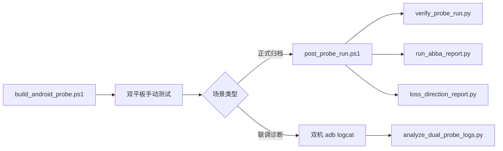

# tools/ 脚本说明

云聚通 Probe 的 PC 侧构建、测后处理与报告工具。完整测试流程见 [docs/README.md](../docs/README.md) 与 [云聚通Probe网络测试执行手册.md](../docs/云聚通Probe网络测试执行手册.md)。

## 前置条件

| 依赖 | 用途 |
| --- | --- |
| JDK 17 + Gradle 9.3 | 编译 Android App（`build_android_probe.ps1` 可自动下载 Gradle） |
| Python 3.10+ | 校验与报告脚本 |
| adb | 从平板拉取导出、双机 logcat |
| 双平板 USB 调试 | MQTT 双机互测、logcat 采集 |

---

## 脚本一览

### 构建

| 脚本 | 说明 |
| --- | --- |
| [`build_android_probe.ps1`](build_android_probe.ps1) | 编译 debug APK。产物：`android-probe-app/app/build/outputs/apk/debug/app-debug.apk` |

```powershell
.\tools\build_android_probe.ps1
adb -s <设备> install -r .\android-probe-app\app\build\outputs\apk\debug\app-debug.apk
```

---

### 测后处理（推荐主流程）

| 脚本 | 说明 |
| --- | --- |
| [`post_probe_run.ps1`](post_probe_run.ps1) | **一条命令**：拉取 → 校验 → 归档 → 场景表 → 过载检测 |
| [`post_probe_run.py`](post_probe_run.py) | 上述步骤 2–5 的 Python 实现（通常由 `.ps1` 调用） |
| [`probe_run_lib.py`](probe_run_lib.py) | 共享库：CSV/Summary 校验、过载识别、场景元数据 |
| [`pull_probe_runs.ps1`](pull_probe_runs.ps1) | 仅从探测端 adb pull 整个 `YunJuTongProbe` 导出目录 |

```powershell
# 每轮测试结束后（AbbaRound 填 A1 / B1 / B2 / A2，非 ABBA 可省略）
.\tools\post_probe_run.ps1 -DeviceId <探测端序列号> -SceneId R1-gz -AbbaRound A1
```

输出：

- 归档目录：`test-runs/<SceneId>/`
- 场景表：`test-runs/scenario_manifest.csv`
- ABBA 副本：`<SceneId>/<AbbaRound>_summary.json`

仅拉取、不做后续处理：

```powershell
.\tools\pull_probe_runs.ps1 -DeviceId <序列号> -OutDir .\test-runs\R1-gz
```

---

### 双机联调（测试中）

联调时双端 logcat **手动采集**（各开一个 PowerShell 窗口），详见执行手册「联调诊断」节。默认序列号：探测 `50f08d16`、回显 `a4fbf4e7`。

**每个窗口须先 `cd` 到仓库根目录并创建 `test-runs`**，否则 `> .\test-runs\probe.log` 会报找不到路径。

```powershell
cd E:\Code_AI_Tool\MNATool
New-Item -ItemType Directory -Force -Path .\test-runs | Out-Null

# 测前清缓冲
adb -s 50f08d16 logcat -c
adb -s a4fbf4e7 logcat -c

# 窗口 A — 探测端
adb -s 50f08d16 logcat -v threadtime ProbeApp:I ProbeApp:D ProbeApp:W ProbeApp:E *:S > .\test-runs\probe.log

# 窗口 B — 回显端
adb -s a4fbf4e7 logcat -v threadtime ProbeApp:I ProbeApp:D ProbeApp:W ProbeApp:E *:S > .\test-runs\echo.log

# 测试结束后 Ctrl+C 停采；拉取导出
.\tools\pull_probe_runs.ps1 -DeviceId 50f08d16 -OutDir .\test-runs\debug
```

| 脚本 | 说明 |
| --- | --- |
| [`analyze_dual_probe_logs.py`](analyze_dual_probe_logs.py) | 深度分析双端 logcat：RTT 尖峰聚类、读包空窗、GC/UI 卡顿关联 |

```powershell
python tools/analyze_dual_probe_logs.py --dir .\test-runs
```

---

### 校验

| 脚本 | 说明 |
| --- | --- |
| [`verify_probe_run.py`](verify_probe_run.py) | 单 run：`samples.csv` 重算指标 vs `summary.json`，输出是否一致 |

```powershell
python tools/verify_probe_run.py `
  .\test-runs\R1-gz\<run目录>\samples.csv `
  .\test-runs\R1-gz\<run目录>\summary.json
```

---

### 报告

| 脚本 | 说明 |
| --- | --- |
| [`run_abba_report.py`](run_abba_report.py) | ABBA 四轮对比 + 弱网设定 vs 实测对照 → Markdown |
| [`loss_direction_report.py`](loss_direction_report.py) | 方向级丢包（去程/回程），需 `samples.csv` + `echo_received.csv` |
| [`group_compare_report.py`](group_compare_report.py) | 多场景分组汇总（协议 × 档位 × 弱网 Profile） |
| [`pipeline_breakdown.py`](pipeline_breakdown.py) | 管道瓶颈：samples 分解 echo_ms/pipe_ms + logcat 四段速率 |

```powershell
# ABBA 报告
python tools/run_abba_report.py `
  --a1 .\test-runs\R1-gz\A1_summary.json `
  --b1 .\test-runs\R1-gz\B1_summary.json `
  --b2 .\test-runs\R1-gz\B2_summary.json `
  --a2 .\test-runs\R1-gz\A2_summary.json `
  --scene "R1-gz 广州测试 实验室十万级" `
  --out .\test-runs\R1-gz\abba_report.md

# 方向丢包
python tools/loss_direction_report.py `
  --samples .\samples.csv --echo .\echo_received.csv --markdown

# 分组对比
python tools/group_compare_report.py --dir .\test-runs\ --out .\test-runs\group_report.md

# 管道分解
python tools/pipeline_breakdown.py `
  --samples .\samples.csv `
  --probe-log .\probe.log `
  --echo-log .\echo.log
```

---

### 开发 / 单元测试

| 脚本 | 说明 |
| --- | --- |
| [`simulate_mqtt_probe.py`](simulate_mqtt_probe.py) | 内嵌 Mock Broker，无真实网络，验证 Java MQTT 编解码与 RTT 逻辑 |
| [`test_probe_run_lib.py`](test_probe_run_lib.py) | `probe_run_lib` 单元测试 |

```powershell
python tools/simulate_mqtt_probe.py
python -m pytest tools/test_probe_run_lib.py -q
```

---

## 典型工作流



1. **编译安装** → `build_android_probe.ps1`
2. **现场测试** → App 双机 MQTT（执行手册 §7）
3. **正式归档** → 每轮 `post_probe_run.ps1`；ABBA 完成后 `run_abba_report.py`
4. **联调排障** → 双机 adb logcat（见执行手册）；必要时 `pipeline_breakdown.py` / `analyze_dual_probe_logs.py`

---

### 飞书结论归档

结论 Wiki 链接统一维护于 [`feishu_doc_config.py`](feishu_doc_config.py)（当前：[测试 v3.0-App Probe](https://q00enigbkuh.feishu.cn/wiki/O7YPwqYNoi2icrk3X7ccLSJCnae)）。测后 ABBA 报告生成后，可用下列脚本同步表格到飞书：

| 脚本 | 说明 |
| --- | --- |
| [`gen_feishu_blocks.py`](gen_feishu_blocks.py) | 从 `test-runs/` 生成飞书 docx XML 块（`_feishu_blocks/`） |
| [`push_feishu_doc.py`](push_feishu_doc.py) | 将 XML 块推送到结论 Wiki（需 `lark-cli` 已登录） |
| [`push_r1_table.py`](push_r1_table.py) | 仅更新 R1 结论表 |
| [`run_abba_report.py`](run_abba_report.py) | 本地 ABBA Markdown；输出含「飞书结论句」可复制段 |

```powershell
# 生成 + 推送（示例）
python tools/gen_feishu_blocks.py
python tools/push_feishu_doc.py --dry-run   # 预览
python tools/push_feishu_doc.py             # 实际上传
```

`_feishu_blocks/`、`_feishu_*.json` 等为本地缓存/调试产物，勿提交仓库。

---

## 已移除的脚本

以下脚本已合并或淘汰，勿再引用：

| 原脚本 | 替代 |
| --- | --- |
| `capture_dual_probe_logs.ps1` / `.py` | 执行手册「联调诊断」双机 adb logcat + `pull_probe_runs.ps1` |
| `watch_dual_probe_run.ps1` | 同上（已删除，改用手动 adb） |
| `_verify_probe_run.py` | `verify_probe_run.py` |
| `_diag_mqtt_connect.py` | 一次性 Broker 连通诊断，已删除 |
| `test_real_mqtt_cn.py` | 真实 Broker 测试改由 Android 双平板 App 完成；协议逻辑用 `simulate_mqtt_probe.py` |

临时采集目录（`_live_logs/`、`_pull_echo/` 等）不应提交仓库；联调 logcat 输出请用 `test-runs/probe.log`、`test-runs/echo.log`。
