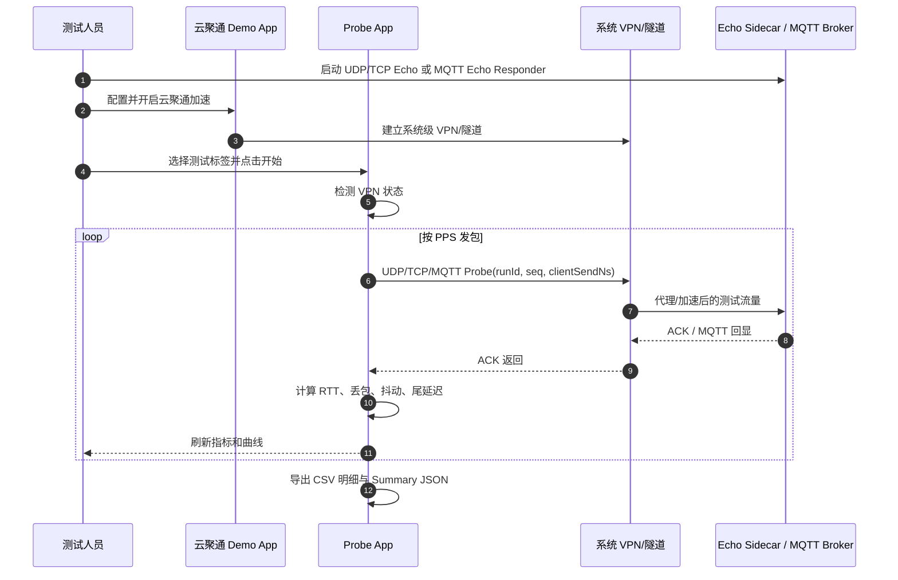

# 云聚通 Probe App MVP 实现说明

## 1. 当前实现边界

MVP 已落地为三个独立部分：

- Android Probe App：`android-probe-app/`
- UDP Echo Sidecar：`server/udp_echo_sidecar/`
- TCP Echo Sidecar：`server/tcp_echo_sidecar/`
- MQTT Echo 对接说明：`server/mqtt_echo_sidecar/`

当前 App 支持 UDP Probe、TCP Echo Probe、MQTT Probe 三种协议。UDP 用于验证真实丢包、抖动和尾延迟；TCP/MQTT 用于验证业务协议层 RTT、应用层超时、重复、乱序和连接稳定性。结论仍需分开解释：TCP/MQTT 会被重传机制影响，不能替代 UDP 的真实丢包判断。

## 2. MVP 交互时序

## 3. Android 端实时呈现

App 首页直接展示可判断效果的聚合指标：

- `Sent / Recv`：发包和收包数
- `Loss`：已确认超时包数和丢包率
- `Avg / P95 / P99`：平均、95 分位、99 分位 RTT
- `Jitter`：按发包序列相邻 RTT 的平均绝对差
- `Burst`：最大连续丢包长度
- `Latest`：最新 RTT
- 曲线图：蓝线表示 RTT，红色竖线表示丢包片段

这比 Excel 逐列堆数据更适合测试现场判断：先看 Summary 指标判断是否有效，再用 CSV 明细定位异常时间段。

## 4. 数据字段

### 4.1 Probe 包字段

| 字段 | 来源 | 说明 |
| --- | --- | --- |
| `runId` | Probe App | 单次测试 ID |
| `seq` | Probe App | 发包序号 |
| `clientSendNs` | Probe App | Android 单调时钟发送时间 |
| `clientSendMs` | Probe App | 墙上时钟发送时间，便于对日志 |
| `protocol` | Probe App | UDP、TCP Echo、MQTT |
| `modeTag` | Probe App | 未加速、云聚通加速、弱网基线、弱网加速 |
| `vpnActive` | Probe App | 发包时是否检测到系统 VPN |
| `packetBytes` | Probe App | 实际 payload 字节数 |
| `serverRecvNs` | Echo Sidecar | 服务端收到包的时间 |
| `serverSendNs` | Echo Sidecar | 服务端发 ACK 的时间 |

### 4.2 计算字段

| 字段 | 计算方式 | 用途 |
| --- | --- | --- |
| `rtt_ms` | `clientRecvNs - clientSendNs` | 端到端往返时延 |
| `lossRate` | `timeout包数 / sent` | 判断丢包改善 |
| `p95RttMs` | RTT 95 分位 | 判断尾延迟改善 |
| `p99RttMs` | RTT 99 分位 | 判断极端尾延迟 |
| `jitterMs` | 相邻 RTT 绝对差均值 | 判断稳定性 |
| `maxBurstLoss` | 最大连续超时包数 | 判断是否有连续卡顿 |
| `duplicate/reordered` | ACK 重复/乱序 | 判断链路异常形态 |

## 5. 测试分组建议

每个网络条件至少跑两组：

1. 未开云聚通：`modeTag=未加速`
2. 开云聚通 Demo App：`modeTag=云聚通加速`

如果要验证弱网，再补：

1. `modeTag=弱网基线`
2. `modeTag=弱网加速`

同一组参数建议固定 `Count/PPS/Bytes/Timeout`，每组至少重复 3 次。最终结论优先比较：

- 丢包率是否下降
- P95/P99 是否下降
- Jitter 是否下降
- 最大连续丢包是否缩短

## 6. 现有中转服务器的使用方式

Echo Server 建议部署在现有业务中转服务器旁边，而不是改造业务服务本身：

- 新开一个 UDP 端口，例如 `9001`
- 新开一个 TCP Echo 端口，例如 `9002`
- 部署 `udp_echo_server.py`
- 部署 `tcp_echo_server.py`
- 放通安全组和系统防火墙 UDP `9001`、TCP `9002`
- MQTT 继续连接现有 Broker，Echo 端使用 `References\MqttTestPython\mqtt_recieve_both.py` 的订阅/回发模式

这样可以保持业务链路无侵入，同时验证云聚通是否能代理并加速其他 App 的 UDP、TCP、MQTT 流量。

## 7. 后续增强点

- 增加 App 内 AB 对比页：读取两次 Summary JSON，直接展示改善率
- 增加批量场景脚本：自动跑未加速/加速/弱网基线/弱网加速
- 增加服务端聚合面板：按 `runId` 汇总服务端视角收包率
